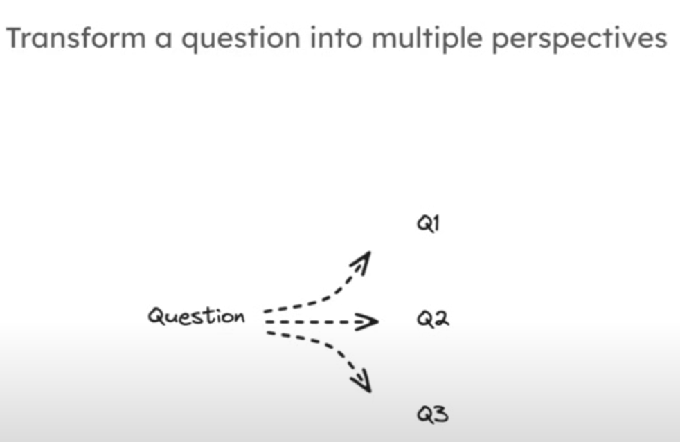
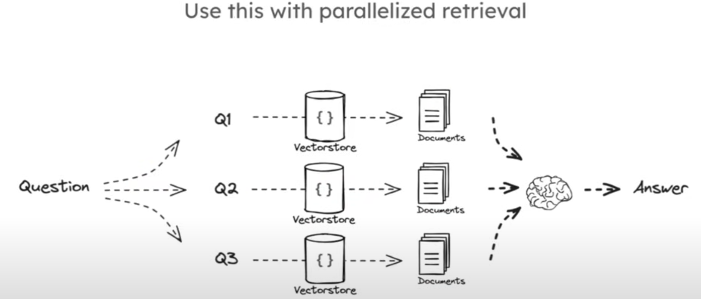

# The Architecture Outline 

## The table of contents for the architecture outline is as follows:

## The Project Architecture
┌─────────────────────────────────────────────────────────────────────────────────────────────────┐
│                                         RAG System Architecture                                  │
├─────────────────┬───────────────────────────────────────────────────────────────────────────────┤
│    **Frontend**  │  Flutter App (Mobile/Web)                                                    │
│                 │  - Handles user queries                                                      │
│                 │  - Displays responses                                                        │
├─────────────────┼───────────────────────────────────────────────────────────────────────────────┤
│    **Backend**   │  Django (Python)                                                            │
│                 │  - REST API for Flutter                                                      │
│                 │  - Handles RAG logic (retrieval + generation)                               │
├─────────────────┼───────────────────────────────────────────────────────────────────────────────┤
│    **Database**  │  Google Cloud Firestore / PostgreSQL (Stores indexed documents)             │
├─────────────────┼───────────────────────────────────────────────────────────────────────────────┤
│    **Vector DB** │  Vertex AI Matching Engine / Pinecone (Stores embeddings for semantic search)│
├─────────────────┼───────────────────────────────────────────────────────────────────────────────┤
│    **LLM**       │  Google Gemini / OpenAI (Generates answers from retrieved docs)             │
└─────────────────┴───────────────────────────────────────────────────────────────────────────────┘
1. ** Overview of the Architecture **
  ## RAG General Architecture Overiview
  

  ### Indexing 
  Indexing is the process through which large volumes of text information can be structured, organized and stored. This enables quick data retrieval of relevant information. This involves converting content into formats that facilitate efficient search 
  and matching within the retrieval-augmented generation framework.
  Key Aspects of Indexing in RAG Systems
  Purpose of Indexing:

  Indexing transforms raw data into a structured format, making it easier to retrieve information quickly. It acts like a   well-organized library, allowing the system to pinpoint relevant sections without sifting through all available data.
  Data Organization:

  Raw data is loaded as Document objects, which include both text and metadata. This data is then split into smaller, manageable  chunks for easier processing and retrieval.
  Vector Representation:

  In RAG systems, documents are often converted into vector representations using techniques such as word embeddings or transformer models. These vectors are stored in a way that allows for rapid access, typically in a vector database or search engine.
  ##### Efficiency of Retrieval:

  The indexed database enables quick searches based on query terms, allowing the system to return relevant documents efficiently.   This is crucial for real-time applications where speed is essential.
  
  Distinction from Embedding: 

  While indexing focuses on organizing and retrieving data, embedding is about transforming data into a vector format that captures its essential qualities. Both processes are integral to the functionality of RAG systems.
  Challenges in Indexing
  
  Data Quality:

  The effectiveness of the retrieval process heavily relies on the quality of the indexed data. Poor quality data can lead to   inaccurate or irrelevant results.

  High Dimensionality:

  As the dimensionality of text embeddings increases, it becomes more challenging to calculate distances between vectors, complicating the identification of similar data points.

  Balancing Speed and Accuracy:

  Achieving a balance between fast retrieval and accurate results is critical. Overly aggressive filtering may exclude relevant   information, while slower methods may hinder performance.
  
  #### Evaluation Metrics:

  There is a lack of standardized metrics to evaluate the quality of retrieved information in RAG indexing, making it difficult to  assess the effectiveness of different indexing strategies.

  #### Indexing Techniques

  Hierarchical Navigable Small World (HNSW):

  This algorithm efficiently finds similar data points by leveraging a graph structure that allows for quick navigation through   connections.

  Inverted File Vector (IVF):

  This technique partitions the vector space into clusters, allowing for faster searches by focusing on the nearest centroid.

  Locality Sensitive Hashing (LSH):

  LSH maps similar data points to the same hash buckets, expediting the retrieval process by grouping similar vectors.
  Product Quantization (PQ):

  This method reduces memory usage and accelerates search processes by decomposing high-dimensional vectors into smaller  sub-vectors.
  Understanding these aspects of indexing in RAG systems is essential for optimizing data retrieval and enhancing the overall   performance of applications that rely on retrieval-augmented generation techniques.

  ## Retrieval Powered via similarity search. 
  
  unlike a tradtional database where they values have to be exact to get a result. Vector databases work of similarity between words, or in this case indexes/embeddings. A simple example of this is how the words donkey and horse can be recognized to 
  be similar because they have similar sematics relative to the question.  
  
  ## Query Translation 
  finding methods to reframe queries from another perspective.this is done because some initial queries are terribly phrased 
  and may lead to Hallucinations in the answers provided. 
  
  Will be using the multi-query approach. This is were we get a question and break it down into smaller questions. The idea behind this is to ensure that even when a query is framed badly. 
   
  using Intuition to improve search. 
  
  The responses to these separate queries can later be combined in the retrieval stage to generate a better response. 
  
  
  
  
  #### Document loading
   Words in indexed files are usually changed to numbers (vectors) for easier processing . This is done using word embeddings or   transformer models. The resulting vectors are then stored in a vector database. 
   
   
    
   In the above section, the documents are first split because embedding models have limits in their size. Then, the documents are   embedded using word embeddings or transformer models. 
